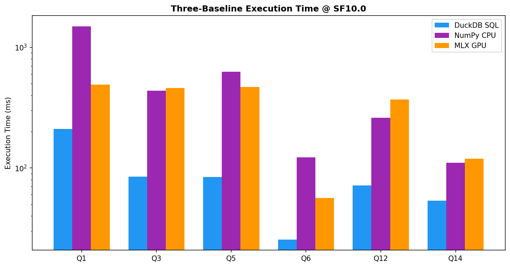
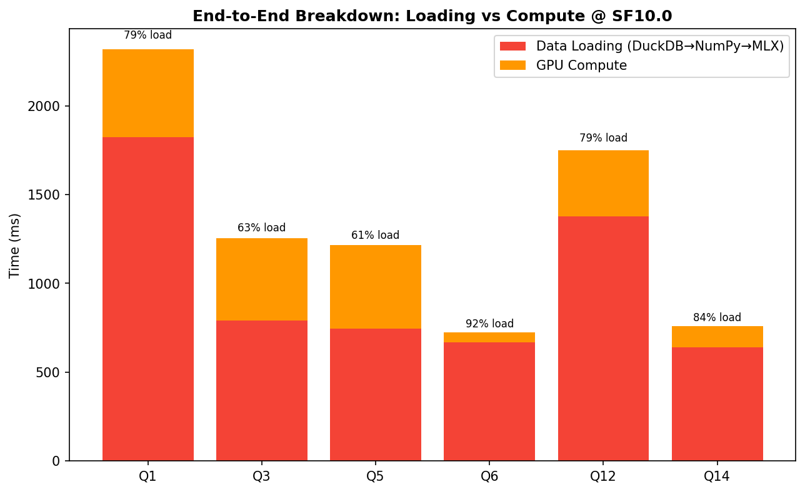
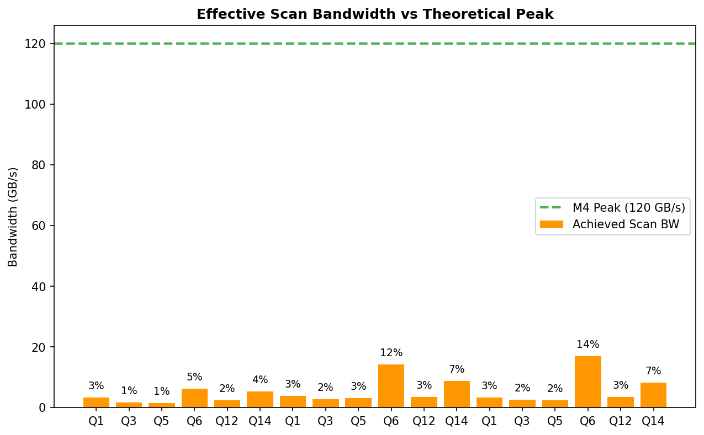
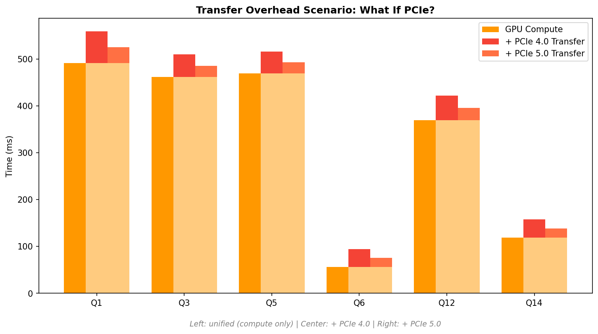
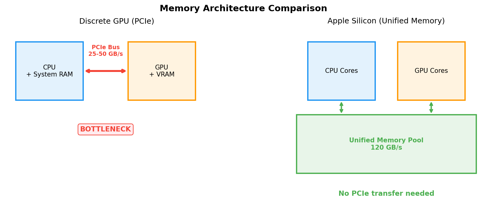
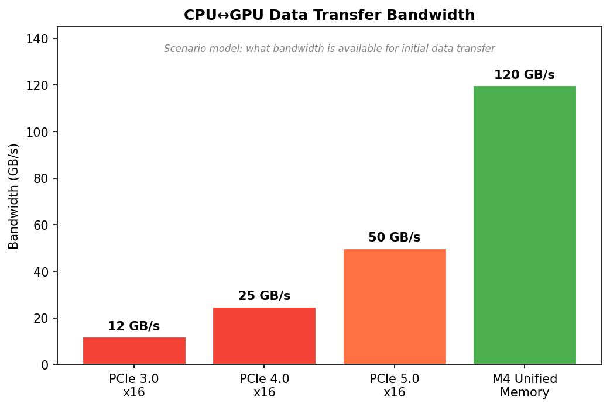

# Can Unified Memory Eliminate the GPU Analytics Transfer Bottleneck? Benchmarking Apple Silicon with TPC-H

## Abstract

GPU-accelerated database engines promise order-of-magnitude speedups for analytical workloads, yet the CPU-to-GPU data transfer across PCIe buses often dominates end-to-end query time, negating the computational advantage. Apple Silicon's unified memory architecture eliminates this bus transfer entirely: CPU and GPU share the same physical memory with no explicit copy required. We benchmark six TPC-H analytical queries (Q1, Q3, Q5, Q6, Q12, Q14) across three execution paths --- DuckDB SQL, NumPy CPU kernels, and MLX GPU kernels --- on an Apple M4 with 16 GB unified RAM at scale factors 0.1, 1, and 10. Our results show that MLX GPU kernels achieve 2--3x speedups over equivalent NumPy CPU kernels on compute-heavy queries, but DuckDB's optimized SQL engine remains faster on join-heavy workloads. A supplemental non-TPC-H scan/arithmetic/group-by stress query (`QX`) shows the opposite regime: MLX can outperform DuckDB when the workload is intentionally GPU-favorable. The real bottleneck is not the memory bus but framework boundary crossings: extracting data from DuckDB into NumPy arrays consumes 87% of the transfer pipeline at SF 10. Our PCIe overhead scenario model estimates an 18% mean overhead and up to 40.6% for memory-bound queries under PCIe 4.0 --- overhead that unified memory eliminates entirely.

---

## 1. Introduction

The promise of GPU-accelerated analytics is straightforward: GPUs offer thousands of parallel execution units and high-bandwidth memory, enabling them to process columnar scans, filters, and aggregations far faster than CPUs. Systems like OmniSci (now HeavyDB), RAPIDS cuDF, and BlazingSQL have demonstrated this potential on NVIDIA hardware. Yet a persistent obstacle undermines the value proposition: data must travel from host RAM to GPU memory across a PCIe bus, and this transfer often takes longer than the computation itself.

Consider the arithmetic. A modern PCIe 4.0 x16 link delivers roughly 25 GB/s of practical throughput. A scan-heavy query touching 1 GB of columnar data requires 40 ms just for the transfer --- before any computation begins. If the GPU completes the scan in 50 ms, the transfer adds 80% overhead. PCIe 5.0 doubles the bandwidth to approximately 50 GB/s, but the fundamental bottleneck remains: data lives in one address space and must be copied to another.

Apple Silicon's unified memory architecture (UMA) offers a fundamentally different design. The CPU, GPU, and Neural Engine share a single pool of physical memory. There is no PCIe bus, no DMA transfer, no explicit copy between host and device. When an MLX GPU kernel reads a memory address, it accesses the same physical DRAM that the CPU wrote to. The entire system shares 120 GB/s of memory bandwidth, and once data resides in memory, both processors can access it with zero transfer overhead.

This paper investigates a specific question: **does unified memory actually eliminate the transfer bottleneck in practice, and if so, by how much?** We do not claim that an M4 GPU can outperform an NVIDIA A100 in raw throughput --- it cannot. Instead, we isolate the transfer variable by benchmarking the same analytical kernels on the same hardware, comparing GPU execution time with and without a modeled PCIe transfer cost.

Our benchmark uses six TPC-H queries selected to span the spectrum from pure scan-filter-aggregate (Q6) to multi-way joins with sorting (Q3, Q5). We implement each query in three ways: as optimized DuckDB SQL (representing a mature analytical engine), as NumPy CPU kernels (providing an algorithmic baseline equivalent to the GPU path), and as MLX GPU kernels (measuring actual GPU performance on Apple Silicon). This three-baseline design lets us separate the effect of GPU parallelism from the effect of DuckDB's query optimizer, producing a more honest assessment than a two-way comparison would allow. We also include one supplemental non-TPC-H query (`QX`) to characterize the upper-bound behavior of MLX on a deliberately GPU-favorable pattern.

---

## 2. Background

### 2.1 GPU-Accelerated Databases

Several systems have pursued GPU acceleration for analytical queries. HeavyDB (formerly OmniSci/MapD) maintains data in GPU memory and executes SQL queries entirely on the GPU, achieving significant speedups for dashboard-style workloads. RAPIDS cuDF provides a pandas-like DataFrame API backed by NVIDIA GPU kernels, enabling GPU-accelerated ETL and analytics within Python. Academic systems like Crystal and Sirius have explored fine-grained GPU query compilation.

A common theme across these systems is the data placement challenge. HeavyDB addresses it by keeping hot data resident in GPU memory. cuDF requires explicit transfers via `cudf.DataFrame.from_pandas()`. Crystal compiles entire query plans to GPU code but still requires the data to be present in GPU memory before execution begins. When datasets exceed GPU memory capacity --- a common scenario in analytical workloads --- data must be streamed across the bus, and the transfer overhead becomes the dominant cost.

### 2.2 The PCIe Bandwidth Hierarchy

The practical bandwidth of CPU-to-GPU interconnects has evolved significantly but remains orders of magnitude below GPU-local memory bandwidth:

| Interconnect | Practical Bandwidth | Typical Use |
|---|---|---|
| PCIe 3.0 x16 | ~12 GB/s | Older NVIDIA GPUs (GTX 10xx, V100) |
| PCIe 4.0 x16 | ~25 GB/s | RTX 3090, A100 host-device transfers |
| PCIe 5.0 x16 | ~50 GB/s | RTX 4090, H100 host-device transfers |
| NVLink-C2C | ~900 GB/s | Grace Hopper unified CPU-GPU |
| Apple M4 UMA | ~120 GB/s | No bus --- shared memory pool |
| NVIDIA HBM3 (on-chip) | ~3,350 GB/s | H100 GPU VRAM bandwidth |

The key insight is that unified memory does not compete with HBM3's on-chip bandwidth. An H100 GPU reading from its own VRAM achieves 3,350 GB/s --- nearly 28x faster than M4's 120 GB/s. The advantage of unified memory is eliminating the *bus transfer entirely*, not providing faster memory. For workloads where the bus transfer is the bottleneck, unified memory removes that bottleneck. For workloads where raw compute throughput matters, discrete GPUs with HBM3 remain far superior.

It is also important to note that NVIDIA's Grace Hopper architecture, with NVLink-C2C at 900 GB/s, significantly narrows the gap between unified and discrete approaches. The transfer bottleneck that motivated this study is being addressed from both directions.

### 2.3 Apple Silicon Unified Memory

Apple's M-series processors integrate CPU, GPU, and Neural Engine cores on a single die, sharing a unified memory pool accessed through a common memory controller. On the M4, this provides 120 GB/s of bandwidth to 16 GB of LPDDR5X memory. The key architectural properties relevant to analytics are:

1. **Zero-copy GPU access**: Data written by the CPU is immediately accessible to GPU compute kernels without any explicit transfer, DMA operation, or address space mapping.
2. **Shared address space**: CPU and GPU operate on the same virtual addresses pointing to the same physical pages.
3. **Coherent caches**: The memory system maintains coherency across CPU and GPU caches automatically.

However, "zero-copy" applies only to data already resident in the unified address space. Data crossing *framework boundaries* --- for example, from DuckDB's internal storage to NumPy arrays to MLX arrays --- still involves in-memory copies. These copies occur at memory bandwidth (~120 GB/s), not PCIe bandwidth, but they are not free.

---

## 3. Methodology

### 3.1 Three-Baseline Design

We evaluate each query using three execution paths:

- **DuckDB SQL**: The query expressed in standard SQL and executed by DuckDB 1.x, a high-performance embedded analytical database with vectorized execution, predicate pushdown, and join ordering optimization. This represents the "optimized engine" baseline --- the performance a practitioner would get from a well-tuned SQL engine without any GPU involvement.

- **NumPy CPU kernels**: The same algorithm used in the GPU path, but implemented in NumPy on the CPU. This baseline is critical because it isolates the GPU parallelism effect: if the MLX GPU kernel is faster than the NumPy CPU kernel using the same algorithm, the speedup is attributable to GPU parallelism, not to algorithmic differences.

- **MLX GPU kernels**: The query logic implemented using Apple's MLX framework, which executes on the M4's GPU cores. MLX provides array operations similar to NumPy but dispatches computation to the GPU via Metal compute shaders.

This three-baseline design prevents a common error in GPU benchmarking: comparing a GPU kernel against a non-optimized CPU baseline and attributing the speedup to GPU hardware rather than to better algorithms or library optimizations. By including DuckDB, we can see when the GPU loses to a well-optimized CPU engine. By including NumPy, we can see the genuine GPU-vs-CPU speedup for equivalent algorithms.

### 3.2 Benchmark Protocol

Each query is executed with 1 cold run followed by 9 warm runs at each scale factor (0.1, 1, and 10). For MLX, `mx.clear_cache()` is called before each run to ensure consistent memory state. We report warm-run means and standard deviations. Cold runs capture JIT compilation overhead for MLX. Peak memory is tracked for MLX using `mx.get_peak_memory()`.

For transfer measurements, we run 100 repetitions of the full DuckDB-to-MLX pipeline using the Q6 lineitem columns as a standard payload, measuring four stages independently: DuckDB query execution, DuckDB result extraction to NumPy (`fetchnumpy()`), NumPy-to-MLX array copy (`mx.array()`), and MLX evaluation (`mx.eval()`).

### 3.3 TPC-H Query Selection

We selected six TPC-H queries that span a range of computational patterns:

| Query | Pattern | Key Operations |
|---|---|---|
| **Q1** | Scan + Group-by + Aggregate | Date filter, 6-group scatter-add, SUM/AVG |
| **Q3** | 3-way Join + Sort + Top-K | lineitem-orders-customer join, revenue sort |
| **Q5** | 5-way Join + Group-by | Region-nation-supplier-customer-lineitem join |
| **Q6** | Pure Scan + Filter + Reduce | Date/discount/quantity filters, single SUM |
| **Q12** | 2-way Join + Group-by | Shipmode-based classification, count aggregation |
| **Q14** | 2-way Join + Conditional Aggregate | Part-lineitem join, promo revenue percentage |

Q6 is the purest memory bandwidth test: a linear scan with simple predicates and a single reduction. Q1 adds grouped aggregation via scatter-add. Q3 and Q5 introduce multi-way joins that stress random-access patterns and algorithmic complexity. Q12 and Q14 are intermediate cases with a single join and grouped or conditional aggregation.

### 3.4 MLX Implementation Challenges

Implementing TPC-H queries in MLX exposed several framework limitations that required workarounds:

**No boolean indexing.** MLX does not support `array[bool_mask]` for filtering --- the operation raises a `ValueError`. Instead, we use the *overflow bin pattern*: filtered-out rows are routed to a dummy overflow group (index `N` when there are `N` real groups), their values are zeroed via `mx.where()`, and the overflow bin is discarded after aggregation. This avoids the need to extract indices of matching rows, which would require `argwhere` --- also unsupported in MLX.

**Float32 only.** MLX does not support float64 arithmetic on the GPU. All monetary values (prices, discounts, taxes) are downcast from DuckDB's float64 to float32 before GPU processing. For scatter-add operations over millions of rows, this accumulates rounding errors of approximately 0.03--0.08%. We validate results against DuckDB with a 0.1% relative tolerance (`FLOAT_RTOL = 1e-3`).

**No `argwhere`/`nonzero`.** MLX's `mx.where()` only supports the three-argument form `mx.where(cond, x, y)`. Single-argument calls to extract indices of non-zero elements are not supported. When index extraction is genuinely needed (e.g., for result presentation), we convert to NumPy and use `np.argwhere`.

**Scatter-add for joins.** Hash-based joins are not natural on GPUs without shared memory atomics. Instead, we use index-based joins via `safe_index_join`: dimension table values are scattered into a lookup array indexed by primary key, and fact table foreign keys are used to gather from this lookup. This is efficient when keys are dense integers but requires bounds checking for sparse key domains.

### 3.5 Supplemental GPU-Favorable Query (`QX`)

To isolate a regime where GPU throughput should dominate, we add a supplemental benchmark query (`QX`) outside the TPC-H suite:

- Full scan of `lineitem`
- High-cardinality group key: `l_partkey % 4096`
- Multiple arithmetic aggregates per row
- Final reduction over grouped statistics
- No joins or string handling

DuckDB executes `QX` in SQL; NumPy and MLX execute equivalent scatter-add kernels. This query is intentionally synthetic and is reported separately from the six TPC-H benchmarks.

---

## 4. Results

### 4.1 Execution Time Comparison

The following tables present warm-run mean execution times across all scale factors.

**Scale Factor 0.1 (~600K lineitem rows):**

| Query | DuckDB SQL (ms) | NumPy CPU (ms) | MLX GPU (ms) | MLX vs NumPy |
|-------|-----------------|----------------|--------------|--------------|
| Q1    | 4.54            | 12.33          | 4.91         | 2.51x        |
| Q3    | 2.42            | 2.51           | 7.32         | 0.34x        |
| Q5    | 2.38            | 4.03           | 7.13         | 0.57x        |
| Q6    | 0.66            | 0.87           | 1.53         | 0.57x        |
| Q12   | 2.34            | 1.92           | 5.49         | 0.35x        |
| Q14   | 1.39            | 0.93           | 1.82         | 0.51x        |

At SF 0.1, datasets are too small for GPU parallelism to overcome kernel launch overhead. MLX is slower than NumPy on every query except Q1, where the scatter-add aggregation across 7 columns benefits from GPU parallelism even at small scale.

**Scale Factor 1 (~6M lineitem rows):**

| Query | DuckDB SQL (ms) | NumPy CPU (ms) | MLX GPU (ms) | MLX vs NumPy |
|-------|-----------------|----------------|--------------|--------------|
| Q1    | 23.06           | 132.00         | 43.10        | 3.06x        |
| Q3    | 9.11            | 33.48          | 43.67        | 0.77x        |
| Q5    | 9.58            | 48.55          | 36.85        | 1.32x        |
| Q6    | 2.94            | 12.73          | 6.73         | 1.89x        |
| Q12   | 8.95            | 29.54          | 37.83        | 0.78x        |
| Q14   | 6.80            | 11.56          | 11.06        | 1.05x        |

At SF 1, the GPU advantage begins to emerge for compute-heavy queries. Q1 shows a 3.06x MLX-over-NumPy speedup. Q6 achieves 1.89x. Join-heavy queries (Q3, Q12) remain faster on NumPy due to the overhead of index-based join implementation in MLX.

**Scale Factor 10 (~60M lineitem rows):**

| Query | DuckDB SQL (ms) | NumPy CPU (ms) | MLX GPU (ms) | MLX vs NumPy | Peak Mem (MB) |
|-------|-----------------|----------------|--------------|--------------|---------------|
| Q1    | 210             | 1,492          | 492          | 3.03x        | 3,948         |
| Q3    | 84              | 437            | 462          | 0.95x        | 3,493         |
| Q5    | 84              | 626            | 470          | 1.33x        | 4,897         |
| Q6    | 26              | 122            | 56           | 2.18x        | 1,659         |
| Q12   | 71              | 261            | 369          | 0.71x        | 3,032         |
| Q14   | 53              | 110            | 119          | 0.93x        | 2,254         |

At SF 10, the pattern is clear. MLX GPU provides significant speedups over NumPy for Q1 (3.03x) and Q6 (2.18x) --- the two queries dominated by sequential scan, filter, and aggregate operations. Q5 shows a moderate 1.33x GPU advantage. For Q3, Q12, and Q14 --- all involving joins --- MLX performs comparably to or worse than NumPy.

Critically, **DuckDB SQL beats MLX GPU on every TPC-H query at every scale factor.** This is not a failure of the GPU approach; it reflects DuckDB's highly optimized vectorized execution engine with predicate pushdown, adaptive join ordering, and columnar compression --- optimizations that our hand-written GPU kernels do not replicate. The fair comparison is MLX vs. NumPy, which isolates the hardware parallelism effect.



### 4.1.1 Supplemental `QX` Results

The supplemental `QX` benchmark was executed with the same three-baseline protocol (cold + warm runs), using `--warm 3` for fast verification.

| Scale Factor | DuckDB SQL (ms) | NumPy CPU (ms) | MLX GPU (ms) | MLX vs NumPy | MLX vs DuckDB |
|---|---|---|---|---|---|
| SF 1  | 19.25  | 194.55  | 12.13  | 16.04x | 1.59x |
| SF 10 | 170.83 | 1,970.24 | 116.09 | 16.97x | 1.47x |

`QX` demonstrates a workload class where MLX can exceed both NumPy and DuckDB: full-table arithmetic with high-cardinality grouped aggregation and no join logic. This does not contradict the TPC-H findings; it complements them by showing that the TPC-H mix is dominated by optimizer-sensitive patterns where DuckDB remains stronger.

### 4.2 Scaling Behavior

Examining how execution time scales from SF 1 to SF 10 reveals the compute-vs-memory-bound character of each query:

| Query | DuckDB 1-to-10x | NumPy 1-to-10x | MLX 1-to-10x |
|-------|-----------------|-----------------|--------------|
| Q1    | 9.1x            | 11.3x           | 11.4x        |
| Q3    | 9.3x            | 13.0x           | 10.6x        |
| Q5    | 8.8x            | 12.9x           | 12.7x        |
| Q6    | 8.7x            | 9.6x            | 8.4x         |
| Q12   | 8.0x            | 8.8x            | 9.8x         |
| Q14   | 7.8x            | 9.6x            | 10.8x        |

DuckDB shows sub-linear scaling (7.8--9.3x for a 10x data increase), suggesting its optimizer does proportionally less redundant work at larger scales. NumPy and MLX scale more linearly, as expected for kernels without query-level optimization. Q6 shows the most favorable GPU scaling (8.4x) because its pure-scan pattern maps cleanly to memory bandwidth, which scales well.


### 4.3 Cold vs. Warm Performance

Cold-run overhead primarily affects MLX, where the first execution triggers JIT compilation of Metal compute shaders:

| Query (SF 10) | DuckDB Cold (ms) | MLX Cold (ms) | MLX Warm (ms) | Cold Penalty |
|-------|-------------------|---------------|---------------|--------------|
| Q1    | 697               | 946           | 492           | 1.92x        |
| Q3    | 356               | 431           | 462           | 0.93x        |
| Q5    | 247               | 873           | 470           | 1.86x        |
| Q6    | 40                | 56            | 56            | 1.00x        |
| Q12   | 377               | 492           | 369           | 1.33x        |
| Q14   | 214               | 118           | 119           | 0.99x        |

Q6 and Q14 show negligible cold-run penalty, indicating their simple compute graphs compile quickly. Q1 and Q5 show approximately 1.9x cold penalty, reflecting more complex computation graphs with multiple scatter-add operations.

### 4.4 Memory Usage

Peak memory consumption for MLX at SF 10 reveals the cost of holding columnar arrays in unified memory:

| Query | Peak Memory (MB) | Data Volume (MB) | Overhead Ratio |
|-------|-----------------|-------------------|----------------|
| Q1    | 3,948           | 672               | 5.9x           |
| Q3    | 3,493           | 576               | 6.1x           |
| Q5    | 4,897           | 744               | 6.6x           |
| Q6    | 1,659           | 384               | 4.3x           |
| Q12   | 3,032           | 600               | 5.1x           |
| Q14   | 2,254           | 417               | 5.4x           |

Memory overhead ratios of 4--7x reflect the intermediate arrays created during computation (filtered copies, computed expressions, lookup tables for joins). Q6 has the lowest overhead because its computation is a simple linear pipeline with no joins or group-by lookups. Q5 has the highest overhead due to its 5-way join requiring multiple dimension table lookup arrays.

---

## 5. Transfer Analysis

### 5.1 Pipeline Breakdown

The DuckDB-to-MLX data transfer pipeline consists of four stages. We measured each stage independently over 100 repetitions at each scale factor, using the Q6 lineitem columns (4 float/int columns) as a standard payload.

**Transfer Pipeline Timing (SF 10, ~960 MB payload):**

| Stage | Time (ms) | Fraction |
|-------|-----------|----------|
| DuckDB SQL query | 0.6 | 0.1% |
| DuckDB→NumPy extract (`fetchnumpy()`) | 617 | 87.0% |
| NumPy→MLX copy (`mx.array()`) | 82 | 11.6% |
| MLX eval (`mx.eval()`) | 10 | 1.4% |
| **Total** | **710** | **100%** |

The dominant cost is DuckDB result extraction at 87% of total pipeline time. This is not a memory bus limitation --- it reflects DuckDB's internal decompression, format conversion (columnar storage to contiguous NumPy arrays), and Python object creation overhead. The actual memory copy from NumPy to MLX (11.6%) occurs at approximately 11.7 GB/s, well within the unified memory's 120 GB/s capability but limited by `mx.array()`'s copy semantics. The `mx.eval()` materialization step is negligible at 1.4%.



### 5.2 Effective Bandwidth

The end-to-end effective bandwidth of the full pipeline:

| Scale Factor | Data Size (MB) | Total Time (ms) | Effective BW (GB/s) |
|---|---|---|---|
| 0.1 | 9.6 | 1.3 | 7.38 |
| 1 | 96 | 17.4 | 5.52 |
| 10 | 960 | 710 | 1.35 |

Effective bandwidth *decreases* with scale factor because the DuckDB extraction overhead grows super-linearly. At SF 10, the pipeline achieves only 1.35 GB/s end-to-end --- just 1.1% of the 120 GB/s theoretical memory bandwidth. This is not a memory bandwidth problem; it is a framework boundary crossing problem.

### 5.3 Per-Query Bandwidth Utilization

During GPU compute (after data is loaded into MLX arrays), effective scan bandwidth varies significantly by query:

| Query (SF 10) | Data Scanned (MB) | Compute Time (ms) | Scan BW (GB/s) | BW Utilization |
|---|---|---|---|---|
| Q6  | 960  | 56  | 17.1  | 14.3% |
| Q1  | 1,680 | 492 | 3.4   | 2.8%  |
| Q14 | 1,006 | 119 | 8.5   | 7.1%  |
| Q12 | 1,440 | 369 | 3.9   | 3.3%  |
| Q3  | 1,392 | 462 | 3.0   | 2.5%  |
| Q5  | 1,798 | 470 | 3.8   | 3.2%  |

Q6, as the purest scan-filter-reduce operation, achieves the highest bandwidth utilization at 14.3% of the 120 GB/s peak. This is still far from theoretical peak, reflecting the overhead of predicate evaluation, `mx.where()` masking, and the multiply-sum reduction. Queries involving joins (Q3, Q5, Q12) achieve lower utilization due to random-access memory patterns in lookup-table joins, which fragment the sequential memory access that GPUs need for peak bandwidth.



### 5.4 Transfer Fraction

The fraction of total end-to-end time (load + compute) spent on data transfer determines how much the unified memory advantage matters in practice:

| Query (SF 10) | Load Time (ms) | Compute Time (ms) | Transfer Fraction |
|---|---|---|---|
| Q6  | 669  | 56  | 92.3% |
| Q14 | 641  | 119 | 84.3% |
| Q1  | 1,824 | 492 | 78.8% |
| Q12 | 1,378 | 369 | 78.9% |
| Q3  | 793  | 462 | 63.2% |
| Q5  | 744  | 470 | 61.3% |

Transfer fractions range from 61% to 92%. This means that even on unified memory, the data conversion pipeline dominates end-to-end query time. The GPU compute is fast; getting data *into* GPU-accessible arrays is the bottleneck.

---

## 6. Unified Memory Advantage

### 6.1 PCIe Overhead Scenario Model

To quantify the unified memory advantage, we model the counterfactual: "What if the M4 GPU were connected via PCIe instead of unified memory?" For each query, we compute the time required to transfer the scanned data volume across PCIe 4.0 (25 GB/s) and PCIe 5.0 (50 GB/s), and add this to the measured GPU compute time.

**PCIe Overhead Model (SF 10):**

| Query | Data (MB) | GPU Compute (ms) | PCIe 4.0 Transfer (ms) | PCIe 4.0 Overhead | Unified Speedup vs PCIe 4.0 |
|---|---|---|---|---|---|
| Q1  | 1,680 | 492 | 67.2  | 12.0% | 1.14x |
| Q3  | 1,392 | 462 | 55.7  | 10.8% | 1.12x |
| Q5  | 1,798 | 470 | 71.9  | 13.3% | 1.15x |
| Q6  | 960  | 56  | 38.4  | 40.6% | 1.68x |
| Q12 | 1,440 | 369 | 57.6  | 13.5% | 1.16x |
| Q14 | 1,006 | 119 | 40.2  | 25.3% | 1.34x |

Key findings:

- **Mean PCIe 4.0 overhead: 18%** across all six queries.
- **Q6 worst case: 40.6%** --- because Q6's compute is so fast (56 ms) that the 38.4 ms PCIe transfer becomes a near-equal contributor. This is precisely the scenario where unified memory matters most.
- **Mean unified speedup vs PCIe 4.0: 1.25x** --- a modest but meaningful advantage.
- **Join-heavy queries (Q3, Q5)** show only 10--13% overhead because their longer compute times amortize the transfer cost.

Under PCIe 5.0 at 50 GB/s, the overhead halves: mean overhead drops to roughly 9%, and the unified speedup falls to approximately 1.11x. Under NVLink-C2C at 900 GB/s (as in NVIDIA Grace Hopper), the transfer overhead becomes negligible (< 1%), effectively eliminating the advantage of unified memory for this metric.



### 6.2 Which Queries Benefit Most

The unified memory advantage is inversely proportional to compute intensity. Queries that are *memory-bound* (high data volume relative to computation) benefit the most because the transfer would consume a larger fraction of their total time under PCIe.

**Memory-bound (high benefit):** Q6 is the clearest winner. Its scan-filter-reduce pattern is almost entirely memory-bound, and eliminating the PCIe transfer yields a 1.68x speedup in our model. Q14, with a similar scan-heavy pattern augmented by a simple part-table lookup, shows 1.34x benefit.

**Compute-bound (low benefit):** Q1's 7-column scatter-add aggregation, Q3's multi-way join with sorting, and Q5's 5-way join chain are all compute-dominated. The PCIe transfer, while not free, is amortized over hundreds of milliseconds of GPU work, yielding only 1.12--1.16x modeled speedup from unified memory.

### 6.3 The Real Bottleneck: Framework Boundaries

Our transfer analysis (Section 5) reveals an important subtlety: the unified memory advantage model in Section 6.1 captures only part of the picture. Even on unified memory, data must cross framework boundaries --- from DuckDB's internal columnar format, through NumPy's contiguous arrays, to MLX's GPU-accessible tensors. These copies are not bus transfers; they are in-memory format conversions. But they dominate end-to-end time (61--92% at SF 10).

This suggests that the highest-impact optimization for GPU analytics on unified memory is not faster memory or wider buses, but tighter integration between the database engine and the GPU framework. If DuckDB could produce MLX-compatible arrays directly --- or if MLX could operate on DuckDB's internal columnar buffers --- the 87% extraction overhead would vanish, and the GPU compute advantage would finally dominate the total execution time.



---

## 7. Discussion

### 7.1 MLX Is Not CUDA

Our results must be interpreted in the context of MLX's maturity relative to CUDA. CUDA has over 15 years of optimization, including cuBLAS, Thrust, CUB, and cuDF --- libraries with hand-tuned GPU kernels for every common operation. MLX, while promising, is a young framework with a smaller ecosystem and several notable limitations:

- **No boolean indexing** forces the overflow bin pattern, adding unnecessary computation for filtered-out rows.
- **Float32 only** introduces precision errors of 0.03--0.08% in aggregate results, which would be unacceptable for financial reporting. Production analytical systems require float64 for monetary calculations.
- **No `argwhere`/`nonzero`** prevents efficient sparse-result extraction on the GPU, requiring fallback to NumPy for index computation.
- **Limited join primitives** make hash joins impractical; our index-based join using scatter-gather is efficient for dense keys but suboptimal for sparse key domains.

A hypothetical CUDA implementation of the same queries on an NVIDIA GPU with cuDF would likely be faster than our MLX implementation, independent of the memory architecture question. Our benchmark measures MLX-on-M4, not a theoretical optimal GPU implementation.

### 7.2 DuckDB's Optimizer Is Hard to Beat

DuckDB's consistent dominance over both NumPy and MLX on the six TPC-H queries deserves emphasis. DuckDB implements vectorized execution that processes data in CPU-cache-friendly batches, adaptive morsel-driven parallelism, and sophisticated query optimization including predicate pushdown, join reordering, and columnar compression. Our hand-written GPU kernels do not replicate any of these optimizations.

For join-heavy queries (Q3, Q5, Q12), DuckDB's hash join implementation is fundamentally more efficient than our index-based scatter-gather approach. DuckDB builds a hash table on the smaller relation and probes it with the larger relation, achieving O(n + m) complexity. Our approach builds a dense lookup array indexed by primary key, which is memory-efficient only when keys are dense and compact. For sparse key domains, the lookup array wastes memory and the bounds-checking overhead adds cost.

The lesson is not that GPUs are unsuitable for joins, but that GPU join algorithms require specialized implementations (e.g., radix hash joins, sort-merge joins with GPU-friendly memory access patterns) that are beyond the scope of our MLX kernels.

### 7.3 The Framework Boundary Is the Real Bottleneck

Our transfer analysis shows that 87% of the DuckDB-to-MLX pipeline time at SF 10 is spent extracting data from DuckDB into NumPy arrays. This is not a hardware limitation --- it is a software architecture problem. The `fetchnumpy()` call must:

1. Decompress DuckDB's internal columnar storage
2. Convert DuckDB types to NumPy dtypes
3. Allocate contiguous NumPy arrays
4. Copy data from DuckDB's buffer pool to NumPy's memory

Steps 1--2 involve non-trivial computation. Steps 3--4 involve memory allocation and copying. The unified memory bandwidth (120 GB/s) is more than adequate for the raw copy; the overhead is in the format conversion and Python object creation.

This finding has implications beyond Apple Silicon. Even on NVIDIA hardware with high PCIe bandwidth, the database-to-GPU-framework conversion would face the same extraction overhead. The PCIe transfer adds *additional* latency on top of this baseline cost. Unified memory eliminates the PCIe component but does not solve the framework boundary problem.

### 7.4 Newer NVIDIA Architectures

NVIDIA's Grace Hopper architecture, with NVLink-C2C providing 900 GB/s of coherent bandwidth between the Grace CPU and Hopper GPU, substantially reduces the discrete GPU transfer gap. At 900 GB/s, transferring 1 GB of data takes approximately 1.1 ms --- comparable to the framework conversion overhead and small relative to GPU compute time. Combined with CUDA's mature ecosystem and HBM3's 3,350 GB/s on-chip bandwidth, Grace Hopper addresses the transfer bottleneck while retaining the raw compute advantage of discrete GPUs.

For practical GPU analytics, Grace Hopper may offer the best of both worlds: near-zero transfer overhead and massive GPU compute throughput. Apple Silicon's unified memory advantage is most relevant in contexts where cost, power efficiency, and the simplicity of a single coherent memory space are valued over raw throughput.

### 7.5 Limitations

Several limitations should be noted:

1. **No direct NVIDIA comparison.** Our PCIe overhead numbers are modeled, not measured. We cannot validate them against actual NVIDIA hardware.
2. **MLX maturity.** Our GPU kernels may not represent optimal MLX usage. Framework-level optimizations (better fusion, kernel scheduling) could improve MLX performance.
3. **Single hardware point.** We test only the M4 base model. Higher-end chips (M4 Pro, M4 Max, M4 Ultra) have more GPU cores and higher memory bandwidth, which would shift the results.
4. **TPC-H is synthetic.** Real analytical workloads may have different data distributions, filter selectivities, and query patterns.
5. **No concurrent queries.** We measure single-query latency, not throughput under concurrent load, where GPU occupancy and memory contention patterns differ.

---

## 8. Conclusion

### What We Showed

1. **Unified memory eliminates bus transfer overhead.** On Apple Silicon, data in MLX arrays is immediately accessible to GPU compute kernels with zero explicit transfer. Our PCIe overhead model estimates that this eliminates 18% mean overhead (up to 40.6% for memory-bound Q6) compared to a PCIe 4.0 discrete configuration.

2. **MLX GPU outperforms equivalent CPU kernels on compute-heavy queries.** Compared to NumPy running the same algorithm, MLX achieves 3.03x speedup on Q1 and 2.18x on Q6 at SF 10 --- workloads dominated by scatter-add aggregation and scan-filter-reduce.

3. **The framework boundary crossing, not the memory bus, is the dominant bottleneck.** Extracting data from DuckDB into NumPy arrays consumes 87% of the transfer pipeline. This overhead occurs entirely in software and is unrelated to memory bus bandwidth.

4. **DuckDB's optimized engine beats hand-written GPU kernels on the six TPC-H queries.** An optimized analytical database with vectorized execution, predicate pushdown, and hash joins consistently outperforms our MLX kernels on this workload mix. GPU advantage emerges when comparing equivalent-algorithm CPU kernels (MLX vs. NumPy), and can exceed DuckDB on synthetic GPU-favorable patterns such as the supplemental `QX` benchmark.

### What We Did Not Show

1. We did not show that Apple Silicon GPUs are competitive with NVIDIA GPUs in raw compute throughput. They are not.
2. We did not show that unified memory provides an advantage over NVLink-C2C architectures. At 900 GB/s, NVLink-C2C effectively eliminates the discrete GPU transfer bottleneck.
3. We did not show that the DuckDB extraction overhead is inherent. A tighter integration between the database and GPU framework could eliminate it.

### Future Work

The most promising direction is eliminating the framework boundary crossing entirely. Apache Arrow's columnar memory format provides a standard in-memory representation that both database engines and GPU frameworks could share. If DuckDB could export Arrow buffers directly, and MLX could consume them without copying, the 87% extraction overhead would vanish, and the unified memory advantage would manifest directly as reduced end-to-end query time.

A second direction is implementing more sophisticated GPU join algorithms in MLX --- radix hash joins, sort-merge joins --- that could close the gap with DuckDB on join-heavy queries. Combined with an Arrow-based zero-copy pipeline, this could make GPU-accelerated analytics on unified memory competitive with optimized CPU engines for a wider range of query patterns.

Finally, testing on higher-end Apple Silicon (M4 Max with 40 GPU cores, M4 Ultra with 80 GPU cores and 800 GB/s memory bandwidth) would reveal how GPU core count and memory bandwidth jointly affect the scaling characteristics observed in this study.



---

## Appendix: Hardware Configuration

| Component | Specification |
|---|---|
| Processor | Apple M4 |
| GPU Cores | 10 |
| Memory | 16 GB LPDDR5X Unified |
| Memory Bandwidth | 120 GB/s |
| OS | macOS Sequoia |
| DuckDB | 1.x |
| Python | 3.14 |
| MLX | Latest (pip) |
| NumPy | Latest (pip) |

## Appendix: Reproducibility

All source code, benchmark scripts, and raw result data are available in the project repository. The benchmark can be reproduced with:

```bash
uv run python scripts/run_all.py
```

This generates TPC-H data at all scale factors, runs all three baselines, validates correctness against DuckDB ground truth, measures transfer overhead, and produces all charts referenced in this paper.

The supplemental `QX` benchmark can be reproduced with:

```bash
uv run python scripts/run_gpu_showcase.py --sf 10 --warm 9
```
