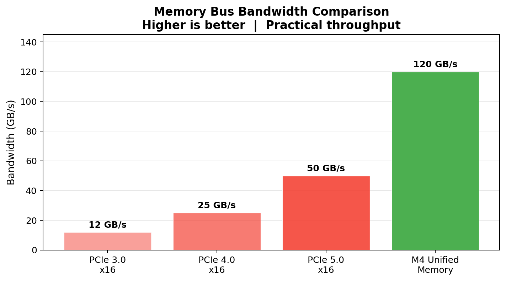
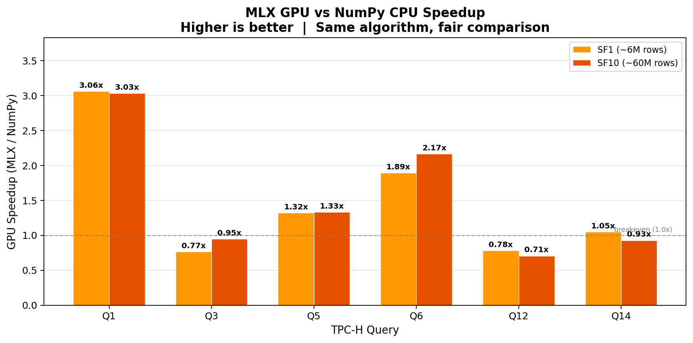
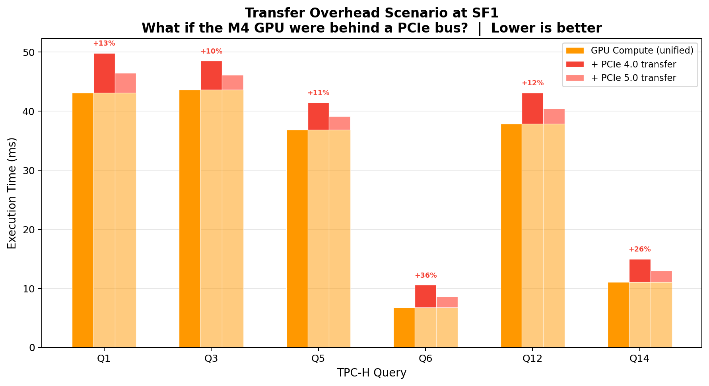
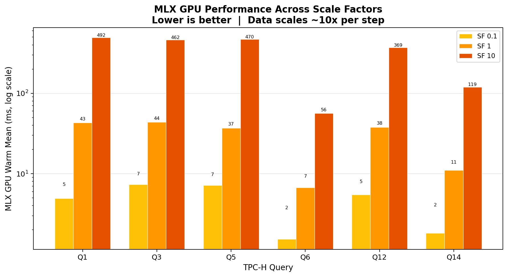

# Unified-DB-2: Apple Silicon Unified Memory for GPU-Accelerated Analytics

Does Apple Silicon's unified memory architecture eliminate the CPU-to-GPU data transfer bottleneck that plagues GPU-accelerated database analytics?

This project benchmarks six TPC-H analytical queries across three execution engines -- DuckDB (optimized SQL), NumPy (CPU kernels), and MLX (GPU kernels) -- on an Apple M4 to quantify the real-world impact of unified memory on analytical query performance. It also includes an optional GPU-favorable showcase query (`QX`) for stress-testing scan + arithmetic + high-cardinality grouped aggregation.

## Motivation

GPU-accelerated databases (BlazingSQL, HeavyDB, Crystal) promise order-of-magnitude speedups for analytical workloads, but a fundamental bottleneck limits their effectiveness: **the PCIe bus**.

On discrete GPU systems, data must be explicitly transferred from host RAM to GPU VRAM before compute can begin:



For scan-heavy analytical queries processing hundreds of megabytes to gigabytes of columnar data, this transfer overhead can dominate total execution time -- often exceeding the GPU compute time itself.

Apple Silicon's unified memory architecture eliminates this bus entirely. CPU and GPU cores share a single physical memory pool at **120 GB/s** bandwidth. There is no device-to-device copy; the GPU reads from the same memory addresses the CPU wrote to. The question is: how much does this actually matter in practice?

## Key Findings

Results from benchmarking on Apple M4 (10 GPU cores, 16 GB RAM, 120 GB/s unified memory):

**MLX GPU vs NumPy CPU (same algorithms, fair comparison):**

At SF1 (~6M lineitem rows), MLX GPU kernels outperform equivalent NumPy CPU kernels on compute-heavy queries. At SF10 (~60M rows), the GPU advantage grows for aggregation-heavy queries but join-heavy queries show diminishing returns due to gather/scatter overhead of sparse index lookups on GPU.



**Supplemental GPU-showcase query (`QX`):**

`QX` is not a TPC-H query. It is intentionally designed to favor GPU throughput: full `lineitem` scan, arithmetic feature synthesis, and 4096-bucket scatter-add aggregation without joins.

| Scale | DuckDB SQL (ms) | NumPy CPU (ms) | MLX GPU (ms) | MLX vs NumPy | MLX vs DuckDB |
|-------|----------------:|---------------:|-------------:|-------------:|--------------:|
| SF1   |           19.25 |         194.55 |        12.13 |       16.04x |        1.59x  |
| SF10  |          170.83 |       1,970.24 |       116.09 |       16.97x |        1.47x  |

The `QX` result demonstrates that MLX can outperform both NumPy and DuckDB when the workload is dominated by massively parallel arithmetic aggregation and avoids join-heavy optimizer-dependent logic.

**Three-baseline comparison at SF1:**


DuckDB's vectorized engine with a full query optimizer consistently outperforms hand-written kernels, especially at larger scale factors. At SF1, DuckDB is 1.5-4.6x faster than MLX on most queries. This is expected -- DuckDB benefits from decades of query optimization research, adaptive execution strategies, and C++ implementation, while the MLX/NumPy kernels use straightforward scatter-add algorithms without query planning.

**Unified memory transfer overhead:**

The scenario model shows that if the M4 GPU were behind a PCIe 4.0 bus, data transfer would add 10-36% overhead to GPU compute time depending on query data volume.



**MLX GPU scaling across data sizes:**



## Architecture

The benchmark pipeline has three layers:

```
                     DuckDB (TPC-H dbgen)
                            |
                     SQL data generation
                            |
              +-------------+-------------+
              |             |             |
        DuckDB SQL     DuckDB SQL     DuckDB SQL
        (execute +     (fetchnumpy)   (fetchnumpy)
         fetchall)          |             |
              |         NumPy arrays  NumPy arrays
              |         (float32)     (float32)
              |             |             |
              |         NumPy CPU     mx.array()    <- copy, not zero-copy
              |         kernels       (MLX GPU)     <- but at 120 GB/s, not 25 GB/s
              |             |             |
        SQL Baseline   CPU Baseline   GPU Baseline
```

**What each baseline measures:**

- **DuckDB SQL** -- What a production analytical engine achieves. Vectorized execution, query optimizer, columnar storage, C++ implementation. The performance target.
- **NumPy CPU** -- Hand-written kernels using identical algorithms to the GPU implementation (scatter-add for group-by, sparse index lookups for joins). Isolates the CPU-vs-GPU compute difference.
- **MLX GPU** -- Same algorithms on Apple Silicon GPU via MLX. Measures GPU compute time separately from data loading time. The data loading pipeline (DuckDB query, NumPy extraction, MLX copy, materialization) is timed at each stage.

**Benchmark protocol:**

1. `mx.clear_cache()` to ensure clean GPU state
2. 1 cold run (includes JIT compilation)
3. 9 warm runs (steady-state performance)
4. Report cold and warm statistics separately

## Project Structure

```
unified-db-2/
|-- pyproject.toml              # Project config (Python >=3.14, deps: mlx, duckdb, numpy, ...)
|-- main.py                     # Entry point stub
|-- scripts/
|   |-- run_all.py              # Full 9-step pipeline: generate -> validate -> bench -> analyze -> chart
|   |-- run_bench.py            # Run specific queries/baselines/scale factors
|   |-- run_gpu_showcase.py     # Supplemental QX benchmark (GPU-favorable scan + group-by)
|-- src/
|   |-- config.py               # Constants, TPC-H epochs, hardware specs, memory budgets
|   |-- data/
|   |   |-- generate.py         # TPC-H data generation via DuckDB dbgen
|   |   |-- loader.py           # DuckDB -> NumPy -> MLX loading pipeline with per-stage timing
|   |   |-- encodings.py        # String -> int encodings for categorical columns
|   |-- cpu/
|   |   |-- duckdb_queries.py   # TPC-H queries as optimized SQL
|   |   |-- numpy_queries.py    # TPC-H queries as NumPy CPU kernels
|   |-- gpu/
|   |   |-- primitives.py       # Reusable MLX ops: scatter-add group-by, safe index join, topk
|   |   |-- query_q1.py         # Q1 Pricing Summary (group-by aggregation)
|   |   |-- query_q3.py         # Q3 Shipping Priority (3-way join + sort + LIMIT)
|   |   |-- query_q5.py         # Q5 Local Supplier Volume (6-way join)
|   |   |-- query_q6.py         # Q6 Forecasting Revenue (scan + filter + reduce)
|   |   |-- query_q12.py        # Q12 Shipping Modes (2-way join + conditional agg)
|   |   |-- query_q14.py        # Q14 Promotion Effect (2-way join + conditional agg)
|   |-- bench/
|   |   |-- runner.py           # Benchmark orchestrator with cold/warm timing
|   |   |-- transfer.py         # DuckDB -> NumPy -> MLX conversion overhead measurement
|   |   |-- validators.py       # GPU/CPU result validation against DuckDB ground truth
|   |   |-- memory.py           # Memory budgeting and runtime tracking
|   |-- analysis/
|   |   |-- theoretical.py      # PCIe vs unified memory scenario model
|   |   |-- bandwidth_model.py  # Effective scan bandwidth and utilization metrics
|   |   |-- comparison.py       # Normalized comparison summary
|   |-- viz/
|       |-- charts.py           # 7 matplotlib chart types
|-- results/                    # Benchmark outputs (JSON + PNG charts)
|-- data/                       # Generated TPC-H DuckDB databases
```

## Prerequisites

- **macOS** with Apple Silicon (M1/M2/M3/M4)
- **Python 3.14+** (see `.python-version`)
- **[uv](https://github.com/astral-sh/uv)** package manager

The project depends on:

- [MLX](https://github.com/ml-explore/mlx) -- Apple's array framework for GPU compute
- [DuckDB](https://duckdb.org/) -- Analytical SQL engine (data generation + SQL baseline)
- [NumPy](https://numpy.org/) -- CPU kernel baseline
- [PyArrow](https://arrow.apache.org/docs/python/) -- Columnar data interchange
- [matplotlib](https://matplotlib.org/) -- Chart generation
- [Rich](https://github.com/Textualize/rich) -- Terminal output formatting
- [psutil](https://github.com/giampaolo/psutil) -- System memory monitoring

## Quick Start

```bash
# Clone the repository
git clone https://github.com/sadopc/unified-db-2.git
cd unified-db-2

# Install dependencies
uv sync

# Run the full benchmark suite (SF 0.1 and 1, ~5 minutes)
uv run python scripts/run_all.py --sf 0.1,1

# Run the full suite including SF 10 (~15-20 minutes, ~5 GB peak memory)
uv run python scripts/run_all.py --sf 0.1,1,10
```

The full pipeline (`run_all.py`) executes 9 steps:

1. **Data generation** -- Creates TPC-H databases via DuckDB's built-in `dbgen`
2. **Memory budgets** -- Pre-computes and validates memory requirements
3. **Validation** -- Verifies GPU/CPU kernels match DuckDB ground truth
4. **Benchmarks** -- Runs all three baselines with cold/warm timing
5. **Transfer measurement** -- 100-rep measurement of the DuckDB-to-MLX pipeline
6. **Theoretical analysis** -- PCIe scenario model
7. **Bandwidth analysis** -- Effective scan bandwidth metrics
8. **Chart generation** -- 7 chart types saved to `results/`
9. **Result export** -- Raw JSON saved to `results/benchmark_results.json`

## Usage Examples

### Run a specific query at a specific scale factor

```bash
# Q6 only, SF 1, all three baselines
uv run python scripts/run_bench.py --query Q6 --sf 1 --baseline all

# Q1 and Q3, SF 10, MLX GPU only
uv run python scripts/run_bench.py --query Q1,Q3 --sf 10 --baseline mlx

# DuckDB SQL only, all queries, SF 0.1
uv run python scripts/run_bench.py --query all --sf 0.1 --baseline duckdb
```

### Run the supplemental GPU-showcase query

```bash
# Recommended: large scale to expose GPU throughput
uv run python scripts/run_gpu_showcase.py --sf 10 --warm 9

# Quick validation pass
uv run python scripts/run_gpu_showcase.py --sf 1 --warm 3
```

### Validation only

```bash
# Validate all queries at SF 0.1 (fast)
uv run python scripts/run_bench.py --validate --sf 0.1

# Validate specific queries
uv run python scripts/run_bench.py --validate --query Q1,Q6 --sf 0.1
```

### Check memory budgets

```bash
uv run python scripts/run_bench.py --memory --sf 10
```

### Generate data without benchmarking

```bash
uv run python scripts/run_bench.py --generate --sf 10 --query Q6 --baseline duckdb
```

### Skip data generation on re-runs

```bash
uv run python scripts/run_all.py --sf 0.1,1,10 --skip-gen --skip-validate
```

### Adjust warm iterations

```bash
# Fewer iterations for faster runs
uv run python scripts/run_all.py --sf 0.1 --warm 3

# More iterations for lower variance
uv run python scripts/run_all.py --sf 1 --warm 20
```

## TPC-H Queries

The benchmark uses six TPC-H queries selected to cover a range of analytical patterns:

| Query | Name                     | Pattern                            | Tables   | Complexity |
|-------|--------------------------|------------------------------------|----------|------------|
| Q1    | Pricing Summary Report   | Filter + group-by + 8 aggregates   | lineitem | Low        |
| Q3    | Shipping Priority        | 3-way join + group-by + sort + TOP | lineitem, orders, customer | Medium |
| Q5    | Local Supplier Volume    | 6-way join + group-by + sort       | lineitem, orders, customer, supplier, nation, region | High |
| Q6    | Forecasting Revenue      | Scan + filter + single SUM         | lineitem | Lowest     |
| Q12   | Shipping Modes           | 2-way join + conditional agg       | lineitem, orders | Medium |
| Q14   | Promotion Effect         | 2-way join + conditional agg       | lineitem, part | Medium |

**Q6** is the purest memory bandwidth test -- four columns, conjunction of filters, single scalar reduction. **Q1** tests scatter-add group-by performance with a high-selectivity filter (~98% of rows pass). **Q3** and **Q5** test join-heavy workloads that stress the GPU's ability to handle sparse index lookups. **Q12** and **Q14** combine joins with conditional aggregation.

**Scale factors and data sizes:**

| SF   | lineitem rows | orders rows | Approx. DB size |
|------|-------------:|------------:|----------------:|
| 0.1  |      600,572 |     150,000 |          ~70 MB |
| 1    |    6,001,215 |   1,500,000 |         ~700 MB |
| 10   |   59,986,052 |  15,000,000 |          ~7 GB  |

## Technical Notes

### MLX Limitations

The GPU kernels work around several MLX constraints:

- **No boolean fancy indexing.** `array[bool_mask]` raises `ValueError` in MLX. All filter operations use `mx.where(mask, value, zero)` with an overflow bin pattern: masked-out rows are routed to a discard group at index `N`, and results are sliced to `[:N]` before returning.

- **No `argwhere` or `nonzero`.** Single-argument `mx.where(mask)` is not supported. When extracting indices of matching elements is required (e.g., Q3's top-k selection), the code converts to NumPy: `np.where(np_array > 0)[0]`.

- **`mx.array(numpy_array)` is a copy, not zero-copy.** Confirmed by MLX documentation. The copy occurs at unified memory bandwidth (~120 GB/s) rather than PCIe bandwidth (25-50 GB/s), but it is still a real copy with real overhead. The loading pipeline times each stage separately to honestly account for this.

- **Float32 only for practical purposes.** All columns are downcast from DuckDB's float64/int64 to float32/int32 before GPU transfer. This halves memory usage and bandwidth requirements but introduces precision loss.

- **No `lexsort`.** Multi-key sorting (needed for Q3: revenue DESC, orderdate ASC) falls back to NumPy.

### Float32 Precision

Scatter-add over millions of rows in float32 accumulates rounding errors. At SF1, Q1 aggregate sums show ~0.03-0.08% relative error versus DuckDB's float64 results. The validation framework uses a 0.1% relative tolerance (`FLOAT_RTOL = 1e-3`) for float aggregates while requiring exact matches for counts and dimension keys.

### Memory Budgeting

The project pre-computes memory budgets before execution to prevent OOM crashes. At SF10, the largest queries (Q1, Q5) require ~3-5 GB of MLX arrays. The loading pipeline uses per-column conversion (load one column to MLX, then delete the NumPy source) to minimize transient peak memory, keeping it to roughly 2.5x the final array size rather than 3x.

Key memory thresholds:
- **16 GB total RAM** (M4 base)
- **~11 GB usable** (leaving ~5 GB for OS + DuckDB)
- **~10 GB chunking threshold** (above this, chunked processing is recommended)

### Data Loading Pipeline

String columns are encoded to integers inside DuckDB using SQL `CASE` expressions before extraction, since MLX cannot process string data. The full pipeline is:

1. **DuckDB SQL** -- Execute query with string-to-int encoding
2. **`fetchnumpy()`** -- Extract results as NumPy arrays
3. **Downcast** -- float64 to float32, int64 to int32
4. **`mx.array()`** -- Copy each column to MLX (one at a time to limit peak memory)
5. **`mx.eval()`** -- Force materialization of lazy MLX arrays

Each stage is individually timed. The transfer benchmark module repeats this 100 times to measure the conversion overhead with statistical confidence.

## Generated Charts

The pipeline produces 7 chart types in `results/`:

| Chart | File | Description |
|-------|------|-------------|
| 1 | `01_architecture_comparison.png` | PCIe vs unified memory architecture diagram |
| 2 | `02_bandwidth_comparison.png` | PCIe 3.0/4.0/5.0 vs M4 unified bandwidth |
| 3 | `03_three_baseline_sf{N}.png` | DuckDB vs NumPy vs MLX execution times (one per SF) |
| 4 | `04_conversion_overhead_sf{N}.png` | Stacked: data loading vs GPU compute time |
| 5 | `05_effective_bandwidth.png` | Achieved scan bandwidth vs 120 GB/s theoretical peak |
| 6 | `06_scale_factor_scaling.png` | Performance scaling across SF 0.1/1/10 |
| 7 | `07_transfer_scenario.png` | "What if PCIe?" modeled transfer overhead |

## Limitations and Caveats

- **Not an apples-to-apples GPU comparison.** The project does not compare M4 GPU to NVIDIA GPU. It compares three execution strategies on the same hardware and models what PCIe overhead _would_ look like.
- **MLX is not cuDF/BlazingSQL.** The GPU kernels are hand-written with basic algorithms (scatter-add, sparse lookups). Production GPU databases use more sophisticated techniques (hash joins, radix partitioning, shared-memory tile optimization).
- **DuckDB has an unfair advantage.** DuckDB is a mature, production-optimized engine written in C++. Comparing it to Python-level NumPy/MLX kernels conflates language overhead with algorithmic differences. The NumPy-vs-MLX comparison is the fair one.
- **Newer NVIDIA architectures reduce the gap.** NVIDIA Grace Hopper (NVLink-C2C at ~900 GB/s) and upcoming PCIe 6.0 significantly reduce host-device transfer overhead.
- **Single-machine results.** All benchmarks run on a specific M4 Mac Mini. Results may differ on M1/M2/M3/M4 Pro/Max/Ultra variants.

## License

MIT

## Citation

If you use this benchmark in research:

```bibtex
@software{unified_db_2,
  title  = {Unified-DB-2: Apple Silicon Unified Memory for GPU-Accelerated Analytics},
  author = {Serdar},
  year   = {2025},
  url    = {https://github.com/sadopc/unified-db-2}
}
```
